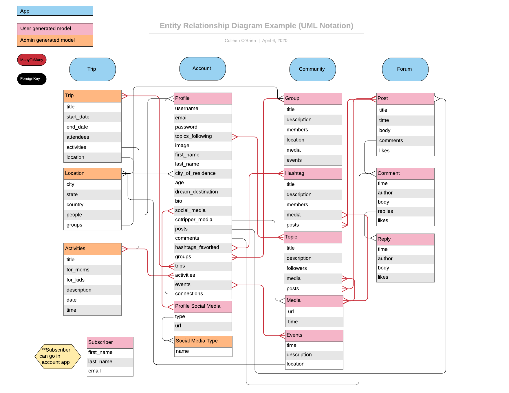

# CoTripper API

## Description

CoTripper is a Django-based project aimed at providing an experience-based travel platform for single mom families. CoTripper aims to encourage ideas, exposure, and to be helpful around helping planning vacations and building community. We're more than a travel solution.

## Technologies

- Python
- Django
- PostgreSQL
- Psql
- Django Rest Framework
- AWS S3

## Database Setup

1. Clone the Repository

```
git clone git@github.com:CotripperPlatform/CoTrip.git
```

1. Run command `pipenv install` this will set up the virtual environment and install dependencies listed in the pipfile.

1. Run the virtual shell `pipenv shell`

1. Run the following command in the shell to load the sql file into postgres

```
psql -U postgres -f settings.sql
```

1. To access our file uploading system on your local project, you'll need access to our local environment variables. This will need to be set up as a `.env` file, saved in the same location as this README. If you're a student at GA working on this project, ask your instructor for it! For other contributors, please reach out to our admins.

## API Description

### ERD

Suggested models, fields, and relationships. Remember, relationships are only defined on one end but can still be selected for from the other. Also, final field decisions in some cases will depend on how and where we want users to generate data, which is unclear from the Figma at this time. For example, we need to decide where a user will be posting the 'media' displayed in the Topic and Hashtag pages, and how Topics and Hashtags and the user's 'scrapbook' will all relate.



### Serializers

- Purpose: Define the API representation

### Views

- Purpose: Define the view behavior

### Urls

- Purpose: Define making between URLs and views

## API Deployment

- Deployed on Heroku
