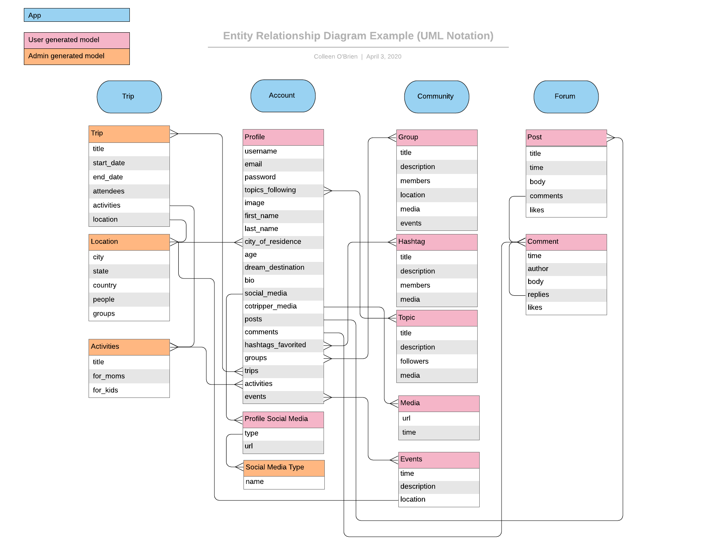

# CoTripper API

## Description

CoTripper is a Django-based project aimed at providing an experience-based travel platform for single mom families. CoTripper aims to encourage ideas, exposure, and to be helpful around helping planning vacations and building community. We're more than a travel solution.

## Technologies

- Python
- Django
- PostgreSQL
- Psql
- Django Rest Framework

## Database Setup

1. Clone the Repository

```
git clone git@github.com:CotripperPlatform/CoTrip.git
```

1. Run command `pipenv install` this will set up the virtual environment and install dependencies listed in the pipfile.

1. Run the virtual shell `pipenv shell`

1. Run the following command in the shell to load the sql file into postgres

```
psql -U postgres -f settings.sql
```

## API Description

### ERD



### Serializers

- Purpose: Define the API representation

### Views

- Purpose: Define the view behavior

### Urls

- Purpose: Define making between URLs and views

## API Deployment

- Deployed on Heroku
