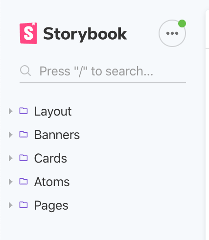

# Description

This is the front end for the CoTripper that will connect to the the backend.

## Getting Started

These instructions will help you get started in getting the React front end to
run on your local machine for testing and development.

### Prerequisites

You will need the following installed locally on your machine:

- [ `pipenv` ](https://github.com/pypa/pipenv)
- [ `pyenv` ](https://github.com/pyenv/pyenv)
- [ `node` ](https://nodejs.org/en/) (>11.0.0)

### Installing

After you have cloned the repository, you'll need to need to make sure that you
work for the correct branch for the part of the project that you are assigned
to. Here's an example:

`git checkout develop` will change your current branch to development.

Then you will need to run the following to install dependencies:

```js
npm install
```

You can then use the following command to start the server on your machine:

```js
npm start
```

### StoryBook Organization

With as many components as we may have for our application, it is important that we stay as organized as possible and do not loose track of where everything is. This part of the README is a short explanation of the organization of our Storybook. The following **bold lines** will be the folders that are listed in the Storybook (as seen below) so that you have a grasp of how it should look and **where to store new components**. There is also going to be a description of **why a component would fall under a certain folder**. Together, if we follow these guidelines, we can keep the Storybook DRY.

---



---

**Layout**

These components are going to be used interchangebly to produce the layout for a full page. Component examples would include but are not limited to...Icons, Logos, Banners, Bio, SignUpAd, Cards, Profile picture's or Footers.

**Atoms/Atomic Components**

An atomic component would be a button or a text input. This is going to be the smallest piece of a UI.

**Molecule Components** (Not Implemented Yet)

A molecule would be a SearchInput component that uses both the button and text input Atoms. A molecule is made up of atoms. If you create a Molecule please list it as such.

**Pages**

These are the physical full pages that have been put together using layout components. These pages might be used interchangebly but are complete pages.

### Proper Syntax for Storybook

When creating a new component and wanting to safely store it, please do so with this Hierarchy in mind.

---

Lets throw a new component into the Atoms folder, here is what it would look like **in stories.js**.

```js
storiesOf("Atoms/<component name>", module);
```

Or maybe for a component that you want to throw into the Layout folder. **In stories.js**, it would look like such

```js
storiesOf("Layout/Logo", module)
  .add("Default", () => <Logo />)
  .add("Small", () => <Logo small />)
  .add("Large", () => <Logo large />)
  .add("Clickable Default Route Small", () => <Logo small clickable />)
  .add("Clickable Route as Prop", () => <Logo clickable to="/route" />);
```

One thing to look out for are **NESTED FOLDERS**. As a team we need to make sure we do this correctly. Watch for spelling and make sure there are no duplicates of the same folder outside of where you would want a folder nested. To create a proper nested folder of **Nav** inside of **Atoms**, it would look like so...

```js
storiesOf("Atoms/Nav/<component_name>", module);
```

### Prototype

You can find the [mock and clickable prototype here](https://www.figma.com/file/ggst6OoJWkwaV2DGq4nBzA/CoTripper?node-id=0%3A1)

### Creating New Components

We use [Hygen]() to generate consistent components. We have a generator for class components as well as function components.

Ensure that Hygen is installed globally:

```js
npm install hygen -g
```

To generate a **function** component, run the following

```js
hygen component-const new --name NameOfComponent
```

To generate a **class** component, run the following

```js
hygen component-class new --name NameOfComponent
```

### Using the `Icon` Component

To use the `Icon` component, first import it, then render it inside your
component, passing in a string representing the icon you'd like to render for
the `icon` prop.

```jsx
import Icon from '../Icon/Icon'


function HelloIcon = props => {
    return (
        <h3>Hello <Icon icon={"heart"}/></h3>
    )
}
```

You can change the size of the icon by passing the prop size:

```jsx
import Icon from '../Icon/Icon'


function HelloIcon = props => {
    return (
        <h3>Hello <Icon icon={"heart"} size={"lg"}/></h3>
    )
}
```

This is a list of sizes that you can use:

- xs
- sm
- lg
- 2x - 10x

You can find the list of icons on the [Font Awesome
website](https://fontawesome.com/). Note that you only need to pass in the
icon's name for the `icon` prop.

### CSS Class Names

- To avoid style conflicts we want to make sure all our CSS selectors are unique.
- This will be the naming convention, based on [BEM](https://css-tricks.com/bem-101/).

```
.ComponentName
.ComponentName--modifier
.ComponentName__element-name
.ComponentName__element-name--modifier
```

For example:

```
.CommentBody {
  color: var(--green);
}

.Logo--small {
  height: 10rem;
}

.CommentBody__date {
  font-size: 2rem;
}

.CommentBody__main--small {
  font-size: 1rem;
}
```

## Deployment

- Deployed on Netlify: https://cotripper.netlify.com/
